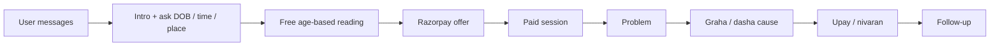

# Pandit G

**WhatsApp Vedic astrology consultation bot** — powered by AI, designed to feel like a real pandit on chat.

Pandit G (देवदत्त जोशी, लखनऊ) greets seekers on WhatsApp, collects birth details (date, time, place), delivers a personalized free reading from age and life stage, then continues into a paid consultation with a natural **problem → planetary cause → remedy** flow.

**Live site:** [panditg.live](https://panditg.live)

---

<p align="center">
  
  
  
  
  
  
</p>

---

## Why this exists

Most astrology chatbots either sound robotic or dump planets and remedies in one message. Pandit G is built around a real consultation rhythm:

1. Introduce the pandit and collect birth details (DOB, time, place)  
2. Share an age-aware free reading (life problems — no graha jargon yet)  
3. Offer a short paid session via Razorpay  
4. After payment, talk **step by step**: problem → why (graha / dasha) → upay  

Replies use a character-based typing delay so the experience feels human, not instant.

---

## Features

| Area | What you get |
|------|----------------|
| **WhatsApp bot** | Full Cloud API webhook, typing indicator |
| **Consultation funnel** | Multi-message birth details, personalized free reading, payment gate |
| **Paid session** | Phase-aware replies (problem → cause → remedy → follow-up) |
| **Moderation** | Agent-based moderation with warnings before block |
| **Admin panel** | `/admin` — WhatsApp-style chat list, detail view, payments, block/unblock |
| **Payments** | Razorpay payment links + webhook → session unlock |
| **Deploy** | Docker + Traefik on Hostinger VPS (`deployment.md`) |

---

## Architecture

```text
WhatsApp user
     │
     ▼
Meta Cloud API ──► /api/webhooks/whatsapp
     │
     ▼
Funnel + AI (xAI Grok) + Moderation
     │
     ├── MongoDB Atlas   (chats, sessions, strikes)
     ├── Razorpay        (dakshina / payment links)
     └── Admin UI        (/admin)
```

| Layer | Stack |
|-------|--------|
| App | Next.js 16 · React 19 · TypeScript · Tailwind |
| AI | xAI Grok (`@ai-sdk/xai`) |
| Data | MongoDB |
| Messaging | WhatsApp Cloud API |
| Payments | Razorpay |
| Hosting | Docker on Hostinger VPS + Traefik SSL |

---

## Quick start (local)

### 1. Clone & install

```bash
git clone https://github.com/YOUR_USERNAME/pandit-g.git
cd pandit-g
npm install
```

### 2. Environment

```bash
cp .env.example .env.local
```

Fill the values in `.env.local` (WhatsApp, xAI, MongoDB, Razorpay, admin).  
See [`.env.example`](./.env.example) for every variable.

### 3. Run

```bash
npm run dev
```

Open [http://localhost:3000](http://localhost:3000) for the landing page and [http://localhost:3000/admin](http://localhost:3000/admin) for the admin panel.

> WhatsApp webhooks need a public HTTPS URL. Use a tunnel (ngrok / Cloudflare) for local webhook testing, or deploy to the VPS.

---

## Project layout

```text
app/
  page.tsx                 # Marketing site
  admin/                   # Admin UI (chats, payments)
  api/webhooks/whatsapp/   # Incoming WhatsApp
  api/webhooks/razorpay/   # Payment events
  api/whatsapp/delayed-send/
lib/
  ai/                      # Prompts, funnel & paid session logic
  whatsapp/                # Client, handlers, human typing
  funnel/                  # Birth details, stages
  moderation/              # Abuse / spam handling
  payments/                # Consultation access
  razorpay/                # Links & config
  db/                      # Mongo collections
Dockerfile
docker-compose.yml
deployment.md              # Full Hostinger production guide
```

---

## Scripts

| Command | Description |
|---------|-------------|
| `npm run dev` | Local development |
| `npm run build` | Production build |
| `npm run start` | Serve production build |
| `npm run lint` | ESLint |

---

## Production deploy (Hostinger)

This project is set up for a **dedicated VPS**, not Vercel Hobby limits.

1. Point `panditg.live` DNS to your VPS  
2. Deploy **Traefik** from Hostinger Docker Manager  
3. Clone the repo on the VPS → create `.env.local`  
4. `docker compose up -d --build`  
5. Point WhatsApp & Razorpay webhooks to `https://panditg.live/...`

**Full step-by-step:** [`deployment.md`](./deployment.md)

```bash
# On the VPS
cd /opt/pandit-g
cp .env.example .env.local   # edit secrets + APP_URL=https://panditg.live
docker compose up -d --build
```

`docker-compose.yml` loads **`.env.local` only**.

---

## Webhooks

| Service | Production URL |
|---------|----------------|
| WhatsApp | `https://panditg.live/api/webhooks/whatsapp` |
| Razorpay | `https://panditg.live/api/webhooks/razorpay` |

Verify token / secrets must match `.env.local`.

---

## Admin

| | |
|--|--|
| URL | `/admin` (login required) |
| Auth | Dynamic admins in MongoDB (email + password) |
| First user | `npm run seed:admin -- --email=... --password=...` (no public signup) |
| Users | Sidebar users icon (next to payments) → add / remove portal admins |
| Reset | Forgot password → Brevo transactional email |

Capabilities: browse chats, payments, block / unblock WhatsApp clients, manage portal admins.

---

## Consultation flow (product)



---

## Environment overview

| Group | Examples |
|-------|----------|
| Public | `APP_URL` |
| WhatsApp | `WHATSAPP_ACCESS_TOKEN`, `WHATSAPP_PHONE_NUMBER_ID`, `WHATSAPP_VERIFY_TOKEN` |
| AI | `XAI_API_KEY`, `XAI_MODEL` |
| DB | `MONGODB_URI`, `MONGODB_DB_NAME` |
| Payments | `RAZORPAY_KEY_ID`, `RAZORPAY_KEY_SECRET`, `RAZORPAY_WEBHOOK_SECRET` |
| UX | `FUNNEL_READING_DELAY_MS`, `TYPING_MS_PER_CHAR`, `TYPING_MAX_MS` |
| Admin | `ADMIN_SESSION_SECRET`, Brevo (`BREVO_API_KEY`, `BREVO_SENDER_EMAIL`) |

Full list: [`.env.example`](./.env.example)

---

## Security notes

- Never commit `.env.local` (gitignored via `.env*`)
- Use strong admin + `INTERNAL_API_SECRET` values in production
- Prefer Razorpay **live** keys only when charging real customers
- Keep MongoDB Atlas network access locked to your VPS IP when possible

---

## License

Private project — all rights reserved unless otherwise stated by the owner.

---

<p align="center">
  <strong>Pandit G</strong> · Consultation that feels human · Built for WhatsApp
  <br />
  <a href="./deployment.md">Deployment guide</a>
  ·
  <a href="./.env.example">Env template</a>
</p>
